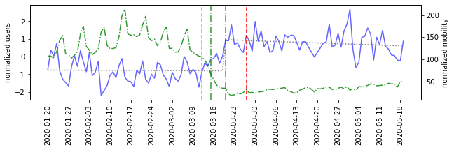

# yt-tw-covid
YouTube links on Twitter around the onset of COVID-19

This project contains aggregated data derived from a dataset of YouTube links shared on Twitter from June 2019 to September 2020, capturing the onset of COVID-19 pandemic. 

## Daily volume by country

In daily_volume folder, you can find three files, measuring different aspects of the data: number of posts, number of unique users, and number of unique videos, shared on that day in a country. The country is determined using GeoNames mapping of the Twitter user Location field.

## Daily volume and mobility plots

The folder plots_users_mobility contains plots of the unique users time series, as well as mobility data (from [Apple Mobility Trends](https://covid19.apple.com/mobility) report) and lockdown dates (from [Oxford's Coronavirus Government response tracker](https://github.com/OxCGRT/covid-policy-tracker)). 

For example:

Shows the plot for Hungary:
* blue: sharing volume in number of unique users
* green: mobility score
* orange vertical line: level 1 lockdown (recommendation)
* red vertical line: level 2 lockdown (mandate)
* blue vertical line: change point for sharing volume
* green vertical line: change point for mobility
* grey: Interrupted Time Series model for media sharing around its change point

The change points were computed using [ruptures](https://github.com/deepcharles/ruptures) library. Interrupted Time Series analysis was performed using OLS, as described in [this paper](https://academic.oup.com/ije/article/46/1/348/2622842).

You can find the "lockdown" dates used for these plots in country_lockdown_dates.csv.

## Original data

As per Twitter's Terms of Service, we cannot post the original data. However, if you are interested in collaborating on a project, please contact Yelena Mejova at <yelenamejova@gmail.com>
